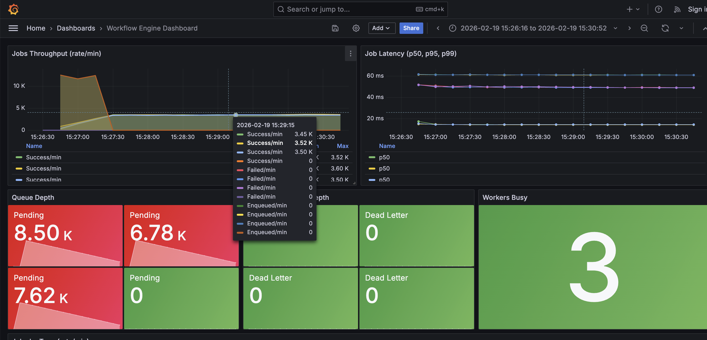
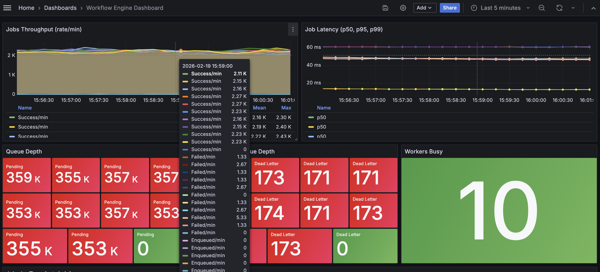
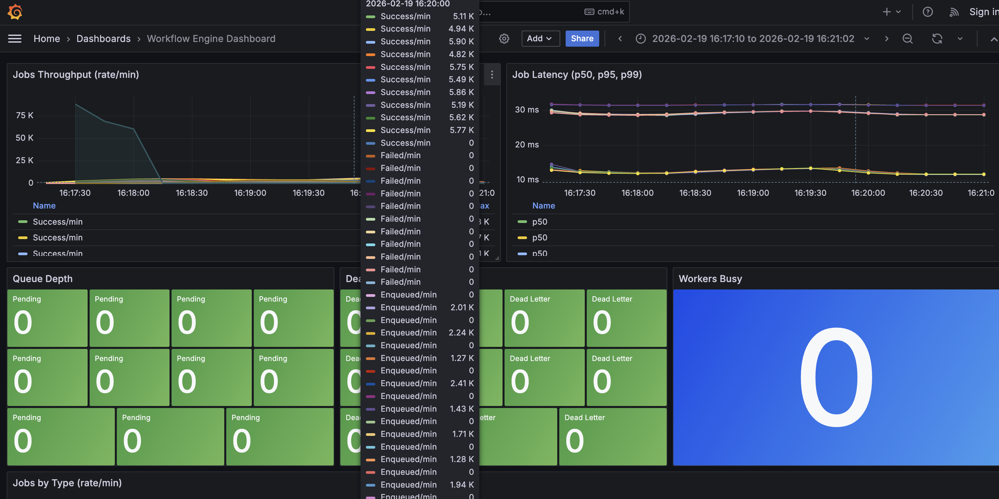

# Distributed Workflow Engine

A production-grade, fault-tolerant workflow orchestration system built in Go. Inspired by [Temporal](https://temporal.io/) and [Apache Airflow](https://airflow.apache.org/), this engine supports durable state, multi-step workflows, automatic retries with exponential backoff, dead letter queues, and horizontal worker scaling.

## Architecture

```
                          ┌──────────────┐
                          │   Grafana    │ :3000
                          │  Dashboards  │
                          └──────┬───────┘
                                 │ query
                          ┌──────▼───────┐
                          │  Prometheus  │ :9090
                          │   Metrics    │
                          └──────┬───────┘
                                 │ scrape
┌─────────┐   enqueue    ┌──────▼───────┐    LPUSH     ┌───────────┐
│  Client  │────────────▶│  API Server  │────────────▶│   Redis    │
│  (HTTP)  │             │    :8080     │              │   Queue    │
└─────────┘              └──────┬───────┘              └─────┬─────┘
                                │                            │ BRPOP
                                │ write state                │
                          ┌─────▼──────┐              ┌──────▼──────┐
                          │            │◀─────────────│   Worker    │ ×3
                          │  Postgres  │  update      │  Scheduler  │
                          │   (SoT)    │              │             │
                          └────────────┘              └─────────────┘
                                                           │
                                                    ┌──────▼──────┐
                                                    │    OTel     │
                                                    │  Collector  │
                                                    └─────────────┘
```

## Design Decisions

### Why Redis for Queueing?
Redis `LPUSH`/`BRPOP` provides a simple, fast, and reliable FIFO queue without the operational overhead of a dedicated message broker. For this system's throughput targets (50k-100k+ jobs/min), Redis comfortably handles the load while keeping the infrastructure minimal.

### Why Postgres as Source of Truth?
All job and workflow state is persisted to PostgreSQL. Redis is treated as an ephemeral queue — if Redis restarts, stale jobs are recovered from Postgres by the worker heartbeat mechanism. This separation gives us both performance (Redis) and durability (Postgres).

### State Machine
Jobs follow a strict state machine: `pending → queued → running → completed | failed → retrying → queued | dead_letter`. Invalid transitions are rejected at the domain level, preventing inconsistent state even under concurrent access.

### Idempotency
Every job carries an idempotency key. The Postgres schema enforces uniqueness via `ON CONFLICT DO NOTHING`, ensuring exactly-once job creation even with duplicate API requests.

## Reliability Model

### Crash Recovery
Workers set a `worker_id` and `started_at` timestamp when claiming a job. A background goroutine periodically scans for jobs stuck in `running` state beyond a configurable timeout (default: 120s), resetting them to `queued` for re-processing.

### Retry Policy
Configurable exponential backoff with jitter:
- **Base delay**: 1s
- **Multiplier**: 2x per attempt
- **Max delay**: 60s
- **Jitter**: ±10% to prevent thundering herd

### Dead Letter Queue
Jobs that exhaust all retry attempts are moved to a Redis-backed dead letter queue and marked as `dead_letter` in Postgres. This preserves failed jobs for debugging and manual intervention.

### Worker Heartbeats
Each worker runs a background goroutine that:
1. Reclaims stale jobs from crashed workers
2. Updates queue depth metrics for Prometheus

## Scaling

### Horizontal Worker Scaling
Workers are stateless consumers. Scale by adjusting the `replicas` count in `docker-compose.yml`:

```yaml
worker:
  deploy:
    replicas: 10
```

Each worker independently polls Redis using `BRPOP`, which provides fair distribution across consumers.

### API Server
The API server is stateless and can be horizontally scaled behind a load balancer. Each instance connects to the same Postgres and Redis.

## Tech Stack

| Component     | Technology                      |
|---------------|---------------------------------|
| Language      | Go 1.22+                        |
| Database      | PostgreSQL 16                   |
| Queue         | Redis 7                         |
| Metrics       | Prometheus + Grafana            |
| Tracing       | OpenTelemetry (OTLP/gRPC)       |
| Container     | Docker + Docker Compose         |

## Getting Started

### Prerequisites
- Docker & Docker Compose
- Go 1.22+ (for local development)

### Run Everything

```bash
# Start all services (API, 3 workers, Postgres, Redis, Prometheus, Grafana)
make up

# Seed sample data
make seed

# Run the load test (50k jobs)
make load-test

# Stop everything
make down
```

### Local Development

```bash
# Run unit tests
make test

# Build binaries
make build

# Apply migrations manually
make migrate
```

### Endpoints

| Endpoint                          | Method | Description            |
|-----------------------------------|--------|------------------------|
| `localhost:8080/health`           | GET    | Health check           |
| `localhost:8080/api/v1/jobs`      | POST   | Enqueue a job          |
| `localhost:8080/api/v1/jobs`      | GET    | List jobs by status    |
| `localhost:8080/api/v1/jobs/:id`  | GET    | Get job details        |
| `localhost:8080/api/v1/workflows` | POST   | Start a workflow       |
| `localhost:8080/api/v1/workflows/:id` | GET | Get workflow details  |
| `localhost:8080/metrics`          | GET    | Prometheus metrics     |

### API Examples

**Enqueue a Job:**
```bash
curl -X POST http://localhost:8080/api/v1/jobs \
  -H "Content-Type: application/json" \
  -d '{"type":"compute","payload":{"iterations":5000},"max_retries":3}'
```

**Start a Multi-Step Workflow:**
```bash
curl -X POST http://localhost:8080/api/v1/workflows \
  -H "Content-Type: application/json" \
  -d '{
    "name": "data-pipeline",
    "steps": [
      {"name":"extract","type":"transform","payload":{"source":"db"},"max_retries":3},
      {"name":"process","type":"compute","payload":{"iterations":1000},"max_retries":2},
      {"name":"notify","type":"notify","payload":{"channel":"slack"},"max_retries":1}
    ]
  }'
```

## Observability

### Grafana Dashboards
Auto-provisioned at [localhost:3000](http://localhost:3000) (admin/admin).

Dashboard panels:
- Jobs throughput (success/fail rate per minute)
- Job latency percentiles (p50, p95, p99)
- Queue depth
- Dead letter queue depth
- Active workers

### Prometheus Metrics

| Metric               | Type      | Description                          |
|----------------------|-----------|--------------------------------------|
| `jobs_total`         | Counter   | Total jobs enqueued, by type         |
| `jobs_success_total` | Counter   | Total jobs completed successfully    |
| `jobs_failed_total`  | Counter   | Total jobs permanently failed        |
| `job_latency_seconds`| Histogram | Time from job start to completion    |
| `queue_depth`        | Gauge     | Current pending queue size           |
| `dead_letter_depth`  | Gauge     | Current dead letter queue size       |
| `worker_busy`        | Gauge     | Worker busy status (per worker)      |

### Distributed Tracing
OpenTelemetry traces are collected via OTLP gRPC and exported to the OTel Collector. Each workflow execution produces:
- A root span covering the entire workflow
- Child spans for each step execution

## Benchmarks

Results from running `make load-test` on my laptop MacBook Pro (M4, 16GB RAM):

```
=== Workflow Engine Load Test ===
Target:      http://localhost:8080
Total Jobs:  50000
Concurrency: 100

  Progress: 5000/50000 jobs (959598 jobs/min)
  Progress: 10000/50000 jobs (1125213 jobs/min)
  Progress: 15000/50000 jobs (1134701 jobs/min)
  Progress: 20000/50000 jobs (1122007 jobs/min)
  Progress: 25000/50000 jobs (1115271 jobs/min)
  Progress: 30000/50000 jobs (1099178 jobs/min)
  Progress: 35000/50000 jobs (1096522 jobs/min)
  Progress: 40000/50000 jobs (1095996 jobs/min)
  Progress: 45000/50000 jobs (1080609 jobs/min)
  Progress: 50000/50000 jobs (1078653 jobs/min)

=== Results ===
Duration:    2.781s
Success:     50000
Failed:      0
Retries:     0
Throughput:  1078649 jobs/min
Avg Latency: 0.06ms/job
```

*Note: Results vary by hardware. The system is designed to exceed 50k jobs/min on commodity hardware.*

## Screenshots



## Test on handling failing jobs

- Added flaky handler — reads failure_rate from payload (0.0-1.0), randomly fails that percentage of executions.

### Load test

- 500k total jobs, concurrency bumped to 200
- 80% reliable (default/compute/notify/transform) — these all succeed
- 20% flaky (100k jobs, 50% failure rate per attempt) — with max_retries: 2, each flaky job gets 3 chances (1 initial + 2 retries).
Probability of all 3 failing: 0.5^3 = 12.5%, so expect ~12,500 jobs in the dead letter queue
- Since we increased total jobs to 500k, we also bump up our workers to 10 replicas.

```
=== Workflow Engine Load Test ===
Target:      http://localhost:8080
Total Jobs:  500000
Concurrency: 200
Job Mix:     80% reliable, 20% flaky (50% failure rate)

  Progress: 50000/500000 jobs enqueued (949430 jobs/min)
  Progress: 100000/500000 jobs enqueued (976027 jobs/min)
  Progress: 150000/500000 jobs enqueued (972891 jobs/min)
  Progress: 200000/500000 jobs enqueued (968391 jobs/min)
  Progress: 250000/500000 jobs enqueued (970327 jobs/min)
  Progress: 300000/500000 jobs enqueued (967673 jobs/min)
  Progress: 350000/500000 jobs enqueued (975336 jobs/min)
  Progress: 400000/500000 jobs enqueued (977176 jobs/min)
  Progress: 450000/500000 jobs enqueued (976334 jobs/min)
  Progress: 500000/500000 jobs enqueued (969795 jobs/min)

=== Enqueue Results ===
Duration:       30.934s
Enqueued:       500000 / 500000
Enqueue Fails:  0
HTTP Retries:   0
Throughput:     969794 jobs/min
Avg Latency:    0.06ms/job

--- Job Mix ---
Reliable jobs:  400000 (should all succeed)
Flaky jobs:     100000 (expect ~12500 in dead letter queue)
```

### Screenshot



## Test on workflows

Run `make load-test-workflow`

```
=== Workflow Engine — Workflow Load Test ===
Target:           http://localhost:8080
Total Workflows:  50000
Steps/Workflow:   3
Total Steps:      150000
Concurrency:      150

  Progress: 5000/50000 workflows submitted (354825 wf/min)
  Progress: 10000/50000 workflows submitted (363412 wf/min)
  Progress: 15000/50000 workflows submitted (361945 wf/min)
  Progress: 20000/50000 workflows submitted (361044 wf/min)
  Progress: 25000/50000 workflows submitted (357184 wf/min)
  Progress: 30000/50000 workflows submitted (350126 wf/min)
  Progress: 35000/50000 workflows submitted (352605 wf/min)
  Progress: 40000/50000 workflows submitted (353159 wf/min)
  Progress: 45000/50000 workflows submitted (359212 wf/min)
  Progress: 50000/50000 workflows submitted (361138 wf/min)

=== Submission Results ===
Duration:          8.307s
Workflows Created: 50000 / 50000
Submit Failures:   0
HTTP Retries:      0
Submit Rate:       361137 workflows/min
Steps Enqueued:    50000 (first step of each workflow)
Total Steps:       150000 (will be created as each step completes)
```

### Screenshot



## Project Structure

```
.
├── cmd/
│   ├── api/          # HTTP API server
│   ├── worker/       # Job processing worker
│   └── migrate/      # Database migration tool
├── internal/
│   ├── job/          # Job domain model & state machine
│   ├── workflow/     # Workflow orchestration engine
│   ├── queue/        # Redis queue interface & implementation
│   ├── storage/      # Postgres repositories
│   ├── retry/        # Retry policy with exponential backoff
│   ├── scheduler/    # Worker execution loop & heartbeats
│   ├── metrics/      # Prometheus instrumentation
│   └── tracing/      # OpenTelemetry initialization
├── pkg/
│   └── client/       # Go SDK for the API
├── deployments/
│   ├── docker-compose.yml
│   ├── prometheus.yml
│   ├── otel-collector.yml
│   └── grafana/      # Auto-provisioned dashboards & datasources
├── scripts/
│   ├── seed/         # Seed sample data
│   └── loadtest/     # Load test script
├── migrations/       # SQL migrations
├── Dockerfile
├── Makefile
└── README.md
```

## Tradeoffs

| Decision                | Tradeoff                                                    |
|------------------------|-------------------------------------------------------------|
| Redis as queue         | Fast but not durable — mitigated by Postgres as source of truth |
| Sequential workflows   | Simpler model but no parallel step execution (by design)    |
| Polling (BRPOP)        | Simple but adds latency vs. push — acceptable at target scale |
| Single binary Docker   | Simpler builds but larger image — acceptable for local dev  |
| In-process retry delay | Blocks the worker goroutine during backoff — fine for demo  |

## License

MIT
